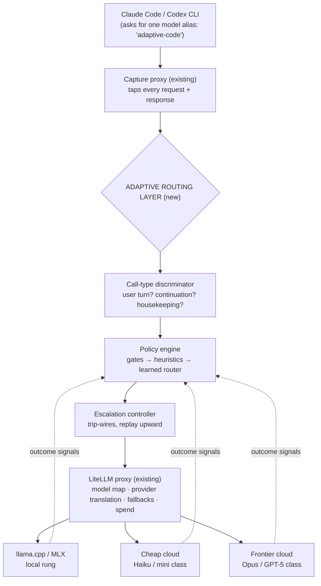
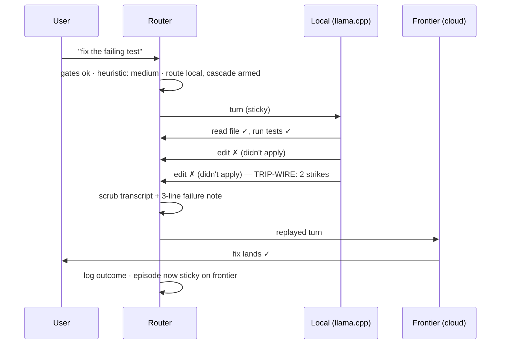
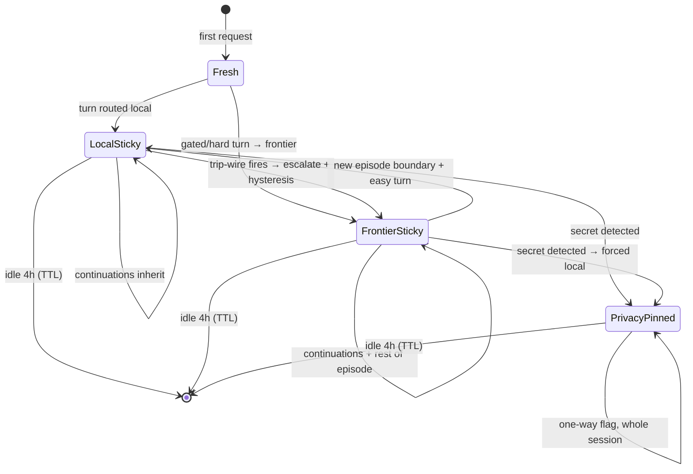

# Adaptive Routing Layer — Design Doc

**Status:** Draft v2 (amended after internal consistency review + deep-research vetting; see §16 changelog) · **Author:** Arun (with Claude) · **Date:** 2026-07-02
**Context:** Existing stack = Claude Code / Codex CLI → capture proxy → LiteLLM → llama.cpp / MLX endpoints + cloud APIs.

---

## 1. What we're building, in one paragraph

Today every request from the coding harness goes to whatever model the static config says. We're adding a layer that looks at each piece of work and decides: *is this cheap-and-easy enough for the local model, or does it deserve a frontier model?* — and, crucially, watches the local model while it works and hands the job upward the moment it starts flailing. Think of it as hospital triage: a nurse (classifier) decides which doctor sees the patient, a junior doctor (local model) handles routine cases under supervision (verifier), and there's a clear protocol for when to page the specialist (frontier model) — including handing over the full chart (transcript replay), not making the patient repeat their story.

**Goal:** cut cloud spend and keep data local where possible, *without* the user feeling a quality drop.
**Non-goal:** beating the frontier model on hard tasks with clever routing. Hard tasks go straight to the frontier model. Routing wins by not wasting frontier tokens on easy work.

---

## 2. The one idea everything hangs on

> **Route *turns*, not HTTP requests.**

When you type one instruction into Claude Code ("fix the failing test"), the harness does not send one request. It sends a burst: the model asks to read a file → harness sends the file back → model asks to run tests → harness sends output back → model proposes an edit → ... Each of those is a separate HTTP request hitting your proxy, and **most of them are the middle of a thought, not a new task.**

If the router re-decides the model on every request, it *will* switch models mid-thought — not occasionally by bad luck, but systematically: context grows with every handshake inside a turn, so any per-request policy that scores context size ratchets upward until it crosses a threshold mid-turn. A switch there cold-starts the KV/prompt cache on the new rung and wastes the old one (expensive), confuses the new model (it inherits another model's half-finished reasoning style), and breaks provider bookkeeping outright — thinking-block signatures (Anthropic) and encrypted reasoning items (OpenAI) don't cross providers; the API rejects the request. (Tool-call IDs are likely only required to be *internally consistent* within a request, not provider-minted — a cheap Phase-0 experiment settles this, and if confirmed it simplifies the escalation rebuild; see §10.) So:

- **Decision points:** when a *new user turn* starts (policy runs), or when a *trip-wire* fires — which acts at the next action boundary, the only moment a switch is even physically possible.
- **Route changes without a decision:** infra fallback — LiteLLM retries a dead endpoint on another rung; the router doesn't decide it but must record it, or the sticky state points at a dead endpoint (scenario S7).
- **Everything else:** inherits the current route ("sticky").

Vocabulary used throughout (also in the glossary, §14):

| Term | Meaning |
|---|---|
| **Turn** | One user instruction + all the model/tool ping-pong until the model answers |
| **Episode** | A run of related turns on the same task ("fix it" → "now add a test") |
| **Rung** | A tier in the model ladder (local small → cheap cloud → frontier) |
| **Trip-wire** | A cheap, mechanical signal that the current rung is failing |
| **Sticky** | Continuation requests keep the turn's route instead of re-deciding |

---

## 3. Where the layer sits



Plain-language division of labor:

- **The harness** doesn't know any of this exists. It talks to one model alias.
- **The capture proxy** keeps doing what it does — but its logs become the training data for the router (the "flywheel", §5.7).
- **The adaptive layer** makes exactly one decision per request: *which model name goes in this request?* It never talks to providers itself.
- **LiteLLM stays the muscle**: it maps names to endpoints, translates Anthropic↔OpenAI formats, retries on infra errors, tracks spend. We deliberately do **not** use LiteLLM's built-in auto-router for classification (see §8.1 for why).

---

## 4. Know your traffic: what actually flows through the proxy

Before designing the router, be clear about what it will see. In a typical coding session (illustrative shares):

| Request kind | Rough share | What it is | Router action |
|---|---|---|---|
| **Token-count bookkeeping** | dominant by raw count (~72% observed on the wire) | `/v1/messages/count_tokens` — context accounting, not a completion | **Pass through untouched.** Identifiable by path alone. |
| **Tool continuation** | 70–90% of completions | The harness returning a tool result mid-turn | **Inherit** the turn's route. No thinking. |
| **Housekeeping / utility call** | 5–15% | Harness sidecar work: titles, topic detection, auto-mode classifiers, compaction. **Wire-verified 2026-07:** sidecars observed on Opus/Sonnet with `max_tokens<=8192`, `tools` absent, `<=2` messages — fingerprint by SHAPE, not model name (the Haiku-class assumption was wrong) | **Hard-pin to local.** Always. Zero risk, instant savings. |
| **New user turn** | 5–15% | The human actually typed something | **Full routing decision.** |
| **Subagent spawn** | occasional | Harness starts a bounded helper ("find where X is defined") | Route independently; usually local (small scope, fresh context). |

Two consequences that shape everything downstream:

1. **The expensive machinery (features, policy, ML) runs on 5–15% of requests.** The hot path for the other 85% is a single state lookup. This is what keeps router overhead near zero.
2. **You cannot classify the raw request body.** By the time a session is 20 turns deep, the "message" is 95% system prompt, file dumps, and tool output. An embedding of that classifies *the files*, not *the intent*. The discriminator must first isolate the actual human sentence.

---

## 5. Component specs

### 5.1 Call-type discriminator

**Job:** label every incoming request as `user_turn` / `continuation` / `utility` / `subagent` in microseconds, using only mechanical rules — no ML, no embeddings.

How each label is detected:

- `continuation` — last message contains a `tool_result` / `tool` role block and the session already has an active turn.
- `passthrough` — not a completion at all: `/v1/messages/count_tokens` (the raw-count majority of wire traffic), `max_tokens<=2` cache-prewarm pings, non-API paths. Identified by path/shape alone; never routed. (Added after live wire capture — the v1 draft missed this kind entirely.)
- `utility` — request matches harness housekeeping fingerprints. **Wire-verified (cc 2.1.201-202):** fingerprint by *shape* — `tools` absent, `max_tokens<=8192`, `<=2` messages — not by model name; observed sidecars run on Opus/Sonnet with `max_tokens=64`, contradicting the draft's Haiku-class assumption. Characteristic system prompts ("summarize this conversation in...") remain a secondary tell. Two subtypes with different routing: `utility:light` (titles, topic detection — always pinned to local-small) and `utility:compaction` (transcript summarization — quality-critical, routed by the episode's current rung; see scenarios doc S14).
- `subagent` — fresh system prompt mid-session, or harness-specific markers (Claude Code subagent calls carry distinct metadata).
- `user_turn` — everything else where the newest message is genuine human text.

**Design rule:** when unsure, label `user_turn`. Worst case you make one extra routing decision; the reverse mistake (treating a real turn as a continuation) silently keeps a bad route alive.

### 5.2 Feature extractor

**Job:** turn a `user_turn` into a small vector of facts, in under ~10ms, so the policy engine has something to reason about. No LLM calls on this path.

| Family | Features (examples) | Why it matters |
|---|---|---|
| **Intent** (from the isolated human sentence only) | verb class (rename/explain vs. refactor/debug/design), scope words ("this function" vs "across the codebase"), file/path mentions, question vs. command | The closest thing to "task difficulty" available upfront |
| **Context** | total prompt tokens, # files currently in context, cumulative diff size this episode | Feasibility: can the local rung even fit this? |
| **Trajectory** | turn index in episode, tool-error rate last N calls, edit-apply failures, loop signals, whether previous turn escalated | The signal chat-routers don't have. A session already going badly should not be handed back to the junior doctor. |
| **Repo** | language, tests present, repo size (cached per workspace, refreshed lazily) | Some stacks are reliably easy/hard for the local model |
| **Policy flags** | privacy tag (secrets seen this session), user override pin | Hard constraints, not preferences |

Intent extraction is heuristic on purpose: last non-tool user message, strip harness boilerplate with known-prefix rules. Embedding the *isolated sentence* (not the payload) is a Phase-3 upgrade.

### 5.3 Policy engine — three layers, cheapest first

Plain-language design principle: **most decisions should be made by dumb rules on purpose.** Dumb rules are fast, debuggable, and can't drift. The ML model only gets the genuinely ambiguous middle.

```python
def route_turn(turn, session, registry) -> Route:
    # ── Layer 0: HARD GATES (safety & feasibility — never overridden) ──
    if session.privacy_pinned or touches_secrets(turn):
        if turn.context_tokens > 0.8 * registry["local"].max_context:
            return Route(rung="local", pinned=True, conflict="pin_context")  # no legal rung — surface to user (§5.8)
        return Route(rung="local", cascade=True, pinned=True)     # trip-wires ARMED; escalation target = USER, not cloud (§5.5)

    rungs = registry.healthy()          # health gate: rungs LiteLLM marks unhealthy don't exist for new turns (§8.3)
    if turn.context_tokens > 0.8 * registry["local"].max_context:
        return Route(rung=cheapest_feasible(rungs, turn), cascade=False)  # cheapest rung that fits — NOT hardcoded frontier
    if session.escalated_this_episode:
        return Route(rung=session.current_rung, cascade=False)    # hysteresis: stay up

    # ── Layer 1: HEURISTICS (fast, explainable — decides ~70% of turns) ──
    s = heuristic_score(turn)      # weighted: verb class, scope, error density, ctx size
    if s < T_EASY:                 # e.g. "rename this variable", "write a commit message"
        return Route(rung="local", cascade=True)      # cascade = cheap insurance
    if s > T_HARD:                 # e.g. "debug this race condition across services"
        return Route(rung="frontier", cascade=False)  # don't burn time on a doomed local try

    # ── Layer 2: LEARNED ROUTER (ambiguous middle only — Phase 3) ──
    p = learned_router.p_local_success(turn.features)  # trained on YOUR captured outcomes
    cost_local_first = C_local + (1 - p) * (C_frontier + WASTED_LATENCY_PENALTY)
    if cost_local_first < C_frontier:
        return Route(rung="local", cascade=True)
    return Route(rung="frontier", cascade=False)
```

Notes:

- `cascade=True` means "try this rung, but the escalation controller is armed."
- `cascade=False` on the frontier path means "this is the top rung, just do it."
- Pinned routes keep trip-wires armed (`cascade=True`), but their escalation *target* is a user-facing message, never a higher rung — S9's "local is struggling, here are your options" behavior depends on this.
- The health gate mirrors production practice (GitHub Copilot's Auto runs a real-time availability/error-rate engine co-equal with its task router — "a model may be capable of handling a task, but that does not mean it is the best choice at that moment"): a rung that is *capable* but currently unhealthy is invisible to new-turn decisions. Health facts come from LiteLLM's background health checks (§8.3) — we consume them, we never ping endpoints ourselves.
- The gates run first *by construction*: a privacy-pinned turn never reaches the difficulty logic, so there is no code path where "it looked easy" leaks a secret to the cloud.
- Thresholds `T_EASY` / `T_HARD` start hand-set, then get tuned from flywheel data.

### 5.4 Capability registry

**Job:** an honest, *measured* profile of each rung. Not marketing benchmarks — numbers from your own eval pack run through your own harness (Raschka's `local-coding-agent-evals` is the right shape; extend it with tasks from your real sessions).

```yaml
rungs:
  local:
    model_class: qwen3-coder-30b      # the BRAIN — the only thing the policy engine picks
    endpoints:                        # the SERVING — LiteLLM picks & fails over among these (§8.3)
      - llamacpp-local                # llama.cpp server
      - mlx-local                     # MLX server, same box — same model, second endpoint
    max_context: 32768                # practical, not theoretical
    prefill_tok_s: 900                # MATTERS: 30k ctx ≈ 33s before first token
    decode_tok_s: 38
    cost_per_mtok: 0.0
    tool_call_reliability:            # per HARNESS, because dialects differ
      claude_code: 0.87               # string-match Edit dialect
      codex: 0.93                     # apply_patch dialect
    parallel_tool_calls: false        # disable unless evals prove otherwise
  cheap_cloud:
    model_class: claude-haiku-4-5
    endpoints: [anthropic-api]
    max_context: 200000
    cost_per_mtok: 1.0
    tool_call_reliability: {claude_code: 0.99}
  frontier:
    model_class: claude-opus-latest
    endpoints: [anthropic-api]
    max_context: 200000
    cost_per_mtok_in: 5.0      # verified 2026-07 (opus-4-8: $5 in / $25 out; cache read 0.1x, write 1.25x)
    cost_per_mtok_out: 25.0    # earlier drafts said 15.0 — wrong
    tool_call_reliability: {claude_code: 0.995}   # never 1.00 — calibration math divides by failure odds
```

Key subtlety: entries are **(model, harness) pairs**. The same local model can be trustworthy under Codex's edit dialect and clumsy under Claude Code's — treating "the model" as one number will mislabel harness-dialect failures as task difficulty.

Second subtlety: **a rung is a model class, not a machine.** OpenRouter's production architecture treats "which model answers" and "which endpoint serves it" as two independent decisions, and so do we. The policy engine only ever picks the rung; LiteLLM owns endpoint selection, health checks, and failover *within* the rung. When llama.cpp OOMs, the right first recovery is the same model on another endpoint (MLX on the same box) — not an escalation. Conflating the two makes infra failures look like task difficulty. Health status lives here too: rungs LiteLLM marks unhealthy are greyed out of new-turn decisions (§5.3 gate) until they recover.

### 5.5 Escalation controller — trip-wires, not judgment

**Job:** watch a `cascade=True` turn and fire when the local model is mechanically failing. All checks are cheap and deterministic; no LLM-judge mid-flight (a judge smart enough to grade the work costs about as much as doing the work).

| Trip-wire | Threshold | Why this signal |
|---|---|---|
| Tool call fails to parse / bad schema | 2 strikes per turn | The model literally can't speak the harness's language right now |
| Edit fails to apply | 2 strikes | Classic local-model failure under Claude Code's exact-string-match edits |
| Identical tool call repeated | 3 identical | The signature of a loop |
| No progress | 6 actions with no new file read, no diff advance, no new command | Valid-looking actions, going nowhere — the subtlest failure mode |
| Turn budget exceeded | e.g. 2× median tokens or 90s wall-clock for this intent class | Runaway turns are expensive in *time*, not just tokens |
| User interrupts / immediately rephrases | 1 event | The strongest quality signal you have; escalate the retry |
| Low local-model confidence (**Phase 3**) | calibrated threshold | The one **leading** indicator — every row above fires *after* wasted actions. A cheap logprob/self-consistency score on the local model's own output lets escalation fire ~5s in instead of ~40s. The cascade-routing literature (Dekoninck et al.) identifies estimator quality as *the* factor deciding whether a ladder beats its baselines. Calibrating it for tool-call output (vs free text) is open research — ships Phase 3, calibrated on flywheel outcomes |

**What escalation actually does (the "handover of the chart"):**

1. Stop at an **action boundary** — never mid-tool-call.
2. Rebuild the turn's transcript for the higher rung: strip thinking blocks, translate edit-dialect artifacts. (LiteLLM translates the *envelope*; this semantic scrubbing is ours.) **Tool-call IDs do NOT need re-minting — B5 verified (2026-07-07):** the Anthropic API accepts foreign-format and arbitrary tool IDs as long as `tool_use.id == tool_result.tool_use_id` within the request; only a *mismatch* is rejected (400). Since the harness's own transcript already preserves that internal pairing, the `tool_id_map` machinery the v2 draft carried is **dropped** — the escalation replay just passes IDs through untouched. The real cross-provider blockers remain thinking-block signatures (Anthropic) and encrypted reasoning items (OpenAI); those are stripped, not re-mapped. This removes the standing per-request ID-translation tax v2 worried about.
3. Prepend a compact failure note: *"A previous attempt tried X; the edit failed to apply twice."* Trade-off: costs ~100 tokens, saves the frontier model from repeating the dead end. Keep it to 3 lines.
4. Mark the session `escalated_this_episode` → hysteresis keeps subsequent turns on the higher rung until a clear new-task boundary (new episode).
5. Charge the switch honestly: escalation cold-starts the higher rung's prompt cache (GitHub Copilot re-routes only at cache boundaries for exactly this reason). The escalate-or-persist decision should carry an explicit cache-loss term; flywheel data (§5.7) tells you when one more local attempt is cheaper than the rebuild.



### 5.6 Session state — and why Redis (§6) 

The router has to *remember* between requests. Minimum viable memory per session:

| Field | Example | Used by |
|---|---|---|
| `route` | `"local"` | continuations (the sticky lookup — hottest read) |
| `active_turn_id` | `t_0042` | discriminator |
| `strikes` | `{parse: 1, edit: 0, loop: 0, noprog: 2}` | escalation controller (atomic increments) |
| `escalated_this_episode` | `true` | hysteresis gate |
| `privacy_pinned` | `true` (a `.env` was read at turn 3) | hard gate — **one-way flag**, only a new session clears it |
| `turn_count`, `episode_stats` | — | features, budgets |
| `working_summary` | 2-line rolling intent summary | resolving "do the same for the other module" |
| `tool_id_map` | `{toolu_L2: toolu_F2, …}` | post-escalation scrubber — applied to **every** request after an escalation, not once (§5.5) |

**Session identity — RESOLVED (B4, wire-verified 2026-07-06):** Claude Code's `metadata.user_id` is a JSON object `{device_id, account_uuid, session_id}` with `session_id` unique per session — parse it and key on `session_id`. The `hash(system_prompt + first_user_message)` fallback is needed only for harnesses that send no session identity. Expire after ~4h idle.

### 5.7 The flywheel — how the router gets smarter

Every routed turn appends one record:

```json
{
  "route_id": "r_8842", "session": "s_17", "turn": 42,
  "features": {"intent": "debug", "ctx_tokens": 41200, "strikes_before": 0},
  "decision": {"rung": "local", "layer": "heuristic", "score": 0.41},
  "outcome": {
    "escalated": true, "tripwire": "edit_apply",
    "local_tokens_wasted": 3800, "wall_clock_s": 74,
    "user_retried": false, "diff_survived_1h": true
  }
}
```

Three uses, in order of value:

1. **Dashboards** (§11) — is this thing actually saving money without hurting quality?
2. **Threshold tuning** — move `T_EASY`/`T_HARD` where the escalation data says they belong.
3. **Training the Layer-2 learned router** — features → "did local succeed without escalation?" is a clean supervised label. Your capture proxy makes this nearly free: you already store request/response pairs; add the route/outcome columns and you can also **replay** historical sessions against candidate policies offline ("what would the escalation rate have been?") before risking live traffic.

Label honesty warning: `user_retried` and `diff_survived_1h` are noisy proxies. Weight them accordingly; never train on `diff accepted` alone — silence is not success. (`diff_survived_1h` also needs an owner — a small git-watcher job that no component currently provides. If that job doesn't ship in v1, drop the field rather than log nulls.)

Two additions from the routing literature:

1. **Training target.** When Layer 2 trains, optimize a cost-aware objective (quality − λ·normalized cost — the xRouter formulation), not imitation of the heuristic decisions, which would just reproduce their blind spots.
2. **The bar to clear.** Under unified evaluation (LLMRouterBench), many learned routers — including commercial ones — lose to the trivial "always use the best single model" baseline. Ours must beat that baseline *and* heuristics-only on replayed traffic before touching a live decision (§10 Phase 3 gate). No published learned router has yet demonstrated gains on multi-turn agentic tool-use traffic; our flywheel is ahead of the literature here, which is a reason for the benchmark gate, not against it.

### 5.8 Pin–feasibility collisions — the defined behavior

The two strongest gates can collide: a privacy-pinned session whose context outgrows the local rung has **no legal rung**. Long pinned sessions hit this on schedule, and the sharpest case is auto-compaction (scenarios S9/S14): a pinned session at 150k tokens needs a summary that no permitted model can even read.

Defined behavior (v1):

1. **Early warning** at 60% of local context on pinned sessions — surface to the user: "this session is pinned to local and growing; consider wrapping up or starting a fresh session."
2. **Forced local compaction** at 75% — summarize the transcript locally *while it still fits* (chunked if needed). The summary will be worse than a frontier one; that is the price of the pin, and it is stated to the user rather than hidden.
3. **Hard stop** past feasibility — refuse cloud escalation and present the same three options as S9: continue with degraded local handling, start a fresh session, or explicitly override the pin. Never silently pick a cloud rung.

The rule that generates all three steps: **the pin always wins; feasibility problems surface to the human rather than weaken the pin.**

---

## 6. Why Redis? (and when you don't need it)

Plain answer first: **the router needs a shared whiteboard.**

Each HTTP request is a separate, isolated event. Python variables live inside one process and die with it. But the router's whole value comes from *remembering things across requests*: "this session is currently on the local model", "that edit has failed twice", "a secret was read — never send this session to the cloud."

What that whiteboard must do:

1. **Shared** — if LiteLLM/your proxy runs multiple worker processes (uvicorn workers, or later multiple machines), request #12 and request #13 of the same session may land on *different workers*. A dict in worker A is invisible to worker B — worker B would happily re-route mid-turn or, worse, ignore a privacy pin.
2. **Fast** — the sticky lookup sits on the hot path of *every* request. It must cost well under a millisecond.
3. **Atomic counters** — tool results can arrive in quick succession (parallel tools, racing retries). "Increment edit-failure strikes" must not lose updates. Redis `INCR`/`HINCRBY` are atomic; a read-modify-write on a dict across workers is a race.
4. **Self-cleaning** — sessions end silently. `EXPIRE session:{id} 14400` makes state evaporate after 4h idle, no janitor process.
5. **A convenient log pipe** — Redis Streams give the flywheel an append-only outcome feed for free.

Redis is simply the boring, battle-tested thing that checks all five boxes with ~zero ops effort. It is **not** load-bearing magic. The honest decision table:

| Your situation | Right store |
|---|---|
| Single proxy process on one machine (**your setup today**) | An in-process dict behind a `SessionStore` interface. Genuinely fine. |
| Multiple proxy workers on one box | Redis (or any shared in-memory store) |
| State must survive proxy restarts mid-session | Redis with persistence, or SQLite |
| Multiple machines / shared team gateway | Redis |
| Durable analytics & training data | **Not Redis** — Postgres/SQLite/parquet. Redis holds *live* state; the flywheel archive belongs in a real database. |

**Recommendation:** define the interface now (`get_session`, `set_route`, `incr_strike`, `pin_privacy`, `append_outcome`), implement it as a dict first, swap in Redis the day you run >1 worker. The interface is the design decision; Redis is just the default grown-up implementation.

```
# Redis keyspace (when you get there)
session:{id}          HASH   route, active_turn_id, escalated, privacy_pinned, turn_count
session:{id}:strikes  HASH   parse, edit, loop, noprog          (HINCRBY, reset per turn)
outcomes              STREAM one entry per routed turn          (flywheel consumer reads)
# all session:* keys get EXPIRE 14400, refreshed on touch
```

---

## 7. Life of a session (state machine)



Note the deliberate asymmetries: escalation is easy, de-escalation only happens at an episode boundary (hysteresis prevents flip-flopping), and the privacy pin is one-way.

---

## 8. Integration with the existing stack

### 8.1 Why not just use LiteLLM's built-in routers?

LiteLLM ships an [auto-router](https://docs.litellm.ai/docs/proxy/auto_routing) (embedding similarity against example utterances), a complexity router (keyword scoring), and a beta adaptive router. All three are **per-request and stateless**: they embed/score the raw message content. For chat traffic that's reasonable; for agent traffic it fails structurally — it would classify tool-result payloads, re-decide mid-turn, and has no concept of strikes, stickiness, episodes, or privacy pins. **Use LiteLLM for execution (fallbacks, health checks, spend, format translation); own the decision yourself.**

### 8.2 Two ways to mount the layer

**Option A — in-process hook (ship this first).** LiteLLM's [`async_pre_call_hook`](https://docs.litellm.ai/docs/proxy/call_hooks) runs before every completion and may rewrite the request:

```python
class AdaptiveRouter(CustomLogger):
    async def async_pre_call_hook(self, user_api_key_dict, cache, data, call_type):
        kind = discriminate(data)                       # §5.1 — mechanical rules
        sess = store.get(session_key(data))

        if kind == "utility":
            data["model"] = "local-small"               # hard pin, done
        elif kind == "continuation":
            data["model"] = sess.route                  # sticky, done
        else:                                           # user_turn / subagent
            route = policy.route_turn(extract_features(data, sess), sess, REGISTRY)
            store.set_route(sess, route)
            data["model"] = route.rung
            data.setdefault("metadata", {})["route_id"] = route.id   # flywheel join key
        return data

    async def async_log_success_event(self, kwargs, response_obj, start, end):
        outcomes.record(kwargs, response_obj)           # feeds §5.7; also run trip-wire checks
```

Trip-wire evaluation lives in the post-call path (inspect the response for tool-call parse validity; inspect the *next* request for edit-failure evidence in tool results). Escalation re-issues the scrubbed transcript as a new internal request to the higher rung.

**Option B — sidecar router service (evolve to this).** A small FastAPI service between capture proxy and LiteLLM: same logic, but policy deploys/retrains without touching the data plane, and it can serve multiple LiteLLM instances. Move here when the hook starts accumulating ML dependencies.

### 8.3 LiteLLM config sketch

```yaml
model_list:
  - model_name: local-code            # llama.cpp or MLX server
    litellm_params: {model: openai/qwen3-coder-30b, api_base: "http://127.0.0.1:8080/v1"}
  - model_name: local-small
    litellm_params: {model: openai/qwen3-4b, api_base: "http://127.0.0.1:8081/v1"}
  - model_name: cheap-cloud
    litellm_params: {model: anthropic/claude-haiku-4-5}
  - model_name: frontier
    litellm_params: {model: anthropic/claude-opus-latest}

router_settings:
  enable_pre_call_checks: true        # LiteLLM filters deployments whose ctx window < request — call-time backstop to our §5.3 gate
  fallbacks:                          # INFRA failures only (timeouts, 5xx, 429) — and WITHIN-rung endpoint failover comes first
    - {local-code: ["cheap-cloud"]}   # semantic escalation is OURS, not LiteLLM's
    - {cheap-cloud: ["frontier"]}

litellm_settings:
  callbacks: adaptive_router.AdaptiveRouter
```

The distinction to keep sharp: **LiteLLM fallbacks fire on exceptions** (endpoint down, rate limit). **Our escalation fires on semantically bad-but-valid responses** (schema-valid tool calls going nowhere). Both are needed; they are different mechanisms.

### 8.5 Who owns which check — avoid double plumbing

LiteLLM already ships much of the operational machinery; rebuilding it means two implementations that drift apart. The dividing line: **we own semantic decisions, LiteLLM owns mechanical enforcement.**

| Concern | Owner | Notes |
|---|---|---|
| Turn difficulty, episodes, stickiness, trip-wires | **Us** | The part nothing else can do |
| Privacy pin | **Us** | Structural gate, layer 0; no gateway ships an equivalent |
| Context feasibility | **Both, deliberately** | We gate at decision time (pick the right rung); LiteLLM's `enable_pre_call_checks` backstops at call time |
| Endpoint health & failover *within* a rung | **LiteLLM** | Background health checks (default 300s interval) remove sick deployments before requests hit them; results feed our §5.3 health gate |
| Retries, rate-limit cooldowns | **LiteLLM** | |
| Spend caps | **LiteLLM** | Per-key/team/model budget enforcement as a hard backstop beneath our §11 dashboards — dashboards observe, budgets enforce |

### 8.4 Format gotchas at the boundary (checklist)

- Claude Code speaks Anthropic `/v1/messages`: thinking blocks, `cache_control` breakpoints, `tool_use` IDs. Local rungs speak OpenAI chat via llama.cpp `--jinja` templates. LiteLLM translates the envelope — but **scrub thinking blocks and re-map tool IDs on escalation replay** (ours, §5.5).
- Verify your llama.cpp/MLX chat template actually emits the tool-call style your harness parses; run the eval pack per (model, harness) pair before adding a rung.
- Disable parallel tool calls on local rungs unless evals prove them reliable.
- Model switches invalidate caches on both sides: llama.cpp slot prefix cache and Anthropic prompt cache (`cache_control`). This is *the* technical reason stickiness exists — a mid-turn switch can cost more than it saves.

---

## 9. What we deliberately do NOT do

| Temptation | Why we refuse |
|---|---|
| Re-route every request "for maximum adaptivity" | Destroys caches, splits one thought across two models, thrash. Turns only. |
| LLM-judge each local action mid-flight | The judge costs ≈ the task. Mechanical trip-wires only; judging happens offline in the flywheel. |
| Cascade *everything* through local first | For clearly-hard turns, expected cost of local-first = local waste + frontier anyway + user's time. Direct-to-frontier is the cheaper path. Cascading pays only where p(local succeeds) is decent. |
| Let the learned router override privacy gates | Gates run first, structurally. An "escalation" that leaks a secret is a security incident, not a quality miss. |
| Trust public benchmarks for the registry | Tool-call reliability is harness-dialect-specific; measure with your own eval pack. |

---

## 10. Rollout plan (each phase has an exit gate)

| Phase | What ships | Risk | Exit criteria |
|---|---|---|---|
| **0 — Shadow** (week 1) | Discriminator + features + policy run on live traffic, *log decisions only*; replay historical captures offline | Zero | Predicted local share & escalation rate look sane on ≥200 real turns; router overhead p50 < 20ms; **best-single-model baseline** computed on replayed traffic (the number Phase 3 must beat); two assumptions tested against real captures — is `metadata.user_id` per-session or per-user, and do tool-call IDs need re-minting cross-provider or only internal consistency? |
| **1 — Pin utility calls + subagent-local pilot** | Housekeeping sidecars → local-small, hardcoded; **bounded read-only subagents → local-code** (re-prioritized: Phase 0 measured easy user turns at 45.5% of turns but only 3.7% of spend, while subagent traffic is 75% of turns and the bulk of token volume — S13 is the dollar lever) | ~Zero for utility (uglier titles); Low for subagents (bounded scope, trip-wires armed) | No harness breakage after 1 week; subagent failure rate ≤ frontier baseline |
| **2 — Gates + heuristics live** | User turns routed; trip-wires armed; kill switch to static config | Moderate | Escalation rate < 30%; user-retry rate on local-handled turns ≤ frontier baseline; zero privacy-pin violations |
| **3 — Learned router** | Layer-2 model trained on Phase 0–2 outcome logs, decides the ambiguous middle | Contained (middle band only) | Beats heuristic-only AND the Phase-0 best-single-model baseline on replay, then live A/B for $/turn at equal retry rate |

Two weeks of Phase 0/1 also answers the "is this worth it?" question with your own numbers before any user-visible risk.

---

## 11. Metrics that decide success

| Metric | Target / alarm |
|---|---|
| Router overhead (p50 / p99 added latency per request) | < 5ms sticky path, < 30ms decision path |
| % turns fully handled locally | The headline savings number — track weekly |
| Escalation rate (of cascaded turns) | < 30%; above ~50% cascading is losing money, tighten `T_HARD` |
| Regret: escalations that gates/heuristics should have sent direct | Wall-clock wasted; drives threshold tuning |
| User-retry rate, by rung | Local must stay ≤ frontier baseline — this is the quality tripcord |
| $ per session, tokens per turn, cache-hit rates | Before/after comparison from capture logs |
| Privacy-pin violations | **Must be zero. Alarm, not a metric.** |

---

## 12. Risks and mitigations

| Risk | Mitigation |
|---|---|
| Silent quality degradation (local "succeeds" with worse code) | User-retry tripcord; sampled offline judging of local-handled turns; diff-survival tracking |
| Flywheel learns from mislabeled failures (harness dialect ≠ difficulty) | Trip-wire *type* is stored with each outcome; dialect failures train the registry, not the difficulty model |
| Local endpoint down/overloaded | LiteLLM health checks + within-rung endpoint failover first (infra path); the rung is greyed out of new-turn decisions until healthy (§5.3 gate) |
| Learned router underperforms the trivial baseline (common in the literature — LLMRouterBench) | Best-single-model benchmark is a hard Phase-3 gate; cost-aware training objective; heuristics remain the permanent fallback path |
| Prefill latency makes local *feel* slow on big contexts | Registry has `prefill_tok_s`; gate on predicted wall-clock, not tokens |
| Scope creep (ML before plumbing) | Phases 0–2 are ML-free by design |
| Session mis-keying splits one session's state in two | Prefer harness-native session IDs; hashing fallback is best-effort; log keying method |

---

## 13. Open questions

1. ~~Two rungs or three at launch?~~ **Resolved: three.** Too much depends on cheap-cloud — the infra fallback chain (S7), oversized-context easy turns (S8), and the compaction floor for frontier episodes (S14). The label-muddying cost is handled by also logging, for every routed turn, which rung a two-rung policy would have chosen.
2. Escalation replay: include the failed local trajectory as a 3-line note (current design) or replay clean? Measure both in Phase 2.
3. Subagent traffic: always local, or run through policy? Start always-local; revisit if subagent failure rate is high.
4. Where does secret-detection run — regex/entropy scan in the discriminator (fast, shallow) or a dedicated scanner on file-read tool results (deeper)? Start with both cheap variants; tune false-positive rate before tightening.
5. Confidence estimator (§5.5 Phase-3 trip-wire): can logprob/self-consistency signals from llama.cpp be calibrated for *tool-call* outputs at interactive latency? No published recipe exists — flywheel outcomes are the calibration set.
6. Secret detected mid-turn while the session is on a **cloud** rung: the secret-bearing continuation is about to leave the machine, but a forced switch to local is the forbidden mid-turn move (S15). Block-and-surface, or let the turn finish then pin? Needs a decision before Phase 2; leaning block-and-surface, since a pin violation is an incident and a broken turn is only an annoyance.

---

## 14. Glossary (plain language)

- **Rung** — a step on the model ladder: local small → cheap cloud → frontier. A rung is a *model class*, not a machine.
- **Endpoint** — a machine/provider serving a rung's model. The router picks rungs; LiteLLM picks endpoints and fails over among them.
- **Turn** — one human instruction plus all the model/tool back-and-forth it triggers.
- **Episode** — consecutive turns on the same piece of work.
- **Sticky** — mid-turn requests reuse the turn's model instead of re-deciding.
- **Trip-wire** — a mechanical "this is failing" detector (edit didn't apply, loop, no progress).
- **Hysteresis** — once escalated, stay escalated until the task changes; prevents flip-flopping.
- **Cascade** — try cheap first with escalation armed, vs. **direct routing** — go straight to the right rung.
- **Prefill** — the model reading the prompt before writing anything; on local hardware with 30k+ context this alone can take tens of seconds.
- **KV / prompt cache** — the reason repeat prompts are fast/cheap; destroyed by switching models mid-turn.
- **Flywheel** — logs of (decision, outcome) that tune thresholds and eventually train the learned router.
- **Shadow mode** — the router computes decisions and logs them but nothing changes for the user.

---

## 15. References

- Raschka — [Components of a Coding Agent](https://magazine.sebastianraschka.com/p/components-of-a-coding-agent); [Using Local Coding Agents](https://magazine.sebastianraschka.com/p/using-local-coding-agents); [local-coding-agent-evals](https://github.com/rasbt/local-coding-agent-evals)
- LiteLLM — [call hooks](https://docs.litellm.ai/docs/proxy/call_hooks) · [auto routing](https://docs.litellm.ai/docs/proxy/auto_routing) · [router & fallbacks](https://docs.litellm.ai/docs/routing)
- Dekoninck et al. — [A Unified Approach to Routing and Cascading for LLMs](https://files.sri.inf.ethz.ch/website/papers/dekoninck2024cascaderouting.pdf) (why routers that can skip rungs beat pure cascades)
- [Dynamic Model Routing and Cascading: a Survey](https://arxiv.org/abs/2603.04445) (incl. LLMRouterBench's caution that many learned routers don't beat simple baselines)
- [RouteLLM](https://github.com/BerriAI/litellm/discussions/4753) · [Router-R1](https://arxiv.org/pdf/2506.09033) · [xRouter](https://arxiv.org/html/2510.08439v1)
- GitHub Copilot — [context handling & model routing](https://github.blog/ai-and-ml/github-copilot/getting-more-from-each-token-how-copilot-improves-context-handling-and-model-routing/) (production sticky/cache-boundary routing + real-time health engine) · [auto model selection](https://docs.github.com/en/copilot/concepts/models/auto-model-selection) · [harness evaluation](https://github.blog/ai-and-ml/github-copilot/evaluating-performance-and-efficiency-of-the-github-copilot-agentic-harness-across-models-and-tasks/) (validates (model, harness) registry keying)
- OpenRouter — [model routing insights](https://openrouter.ai/blog/insights/model-routing/) (model-vs-provider decomposition, health-gated provider selection) · [provider selection](https://openrouter.ai/docs/guides/routing/provider-selection)
- [LLMRouterBench](https://arxiv.org/html/2601.07206v1) (unified router evaluation — several learned/commercial routers lose to the best-single-model baseline)

---

## 16. Changelog

**v2.1 (2026-07-07)** — corrections from LIVE WIRE EVIDENCE (Phase 0 capture proxy, cc 2.1.201-202) and Phase 0 economics:

- **Session identity resolved (B4)**: `metadata.user_id` carries a per-session `session_id` — parse and key on it; hash fallback demoted to non-Claude-Code harnesses (§5.6).
- **New request kind `passthrough`**: `/v1/messages/count_tokens` is ~72% of raw wire traffic and was missing from the v1/v2 taxonomy entirely; plus prewarm pings and non-API paths (§4, §5.1).
- **Sidecar fingerprint corrected**: utility calls observed on Opus/Sonnet with `max_tokens=64`, not Haiku-class — fingerprint by shape (no tools, tiny output budget, ≤2 messages), not model name (§4, §5.1).
- **Registry price fixed**: frontier is $5/MTok in, $25 out (drafts said 15.0) (§5.4).
- **Phase 1 re-prioritized**: subagent-local pilot promoted alongside utility pinning — Phase 0 measured easy user turns at 3.7% of spend vs subagent traffic at 75% of turns; S13 is the dollar lever (§10).
- **Tool-ID re-minting dropped (B5)**: live experiment confirmed IDs need only be internally consistent, not provider-minted — the `tool_id_map` machinery is removed from the escalation rebuild (§5.5); thinking-block signatures / encrypted reasoning remain the real cross-provider blockers.

**v2 (2026-07-02)** — amendments from an internal consistency review plus deep-research vetting against production routers (GitHub Copilot Auto, OpenRouter, LiteLLM) and the routing literature (ETH cascade routing, LLMRouterBench, Router-R1, xRouter):

- **Health gate** added to policy layer 0 (§5.3): rungs LiteLLM marks unhealthy are invisible to new-turn decisions — production routers treat availability as co-equal with task features.
- **Pinned routes keep trip-wires armed** (§5.3): `cascade=True` with the escalation target set to the user, not a higher rung — fixes a contradiction with scenario S9.
- **Pin–feasibility collision behavior defined** (new §5.8): early warning → forced local compaction → hard stop; the pin always wins.
- **Rung/endpoint split** in the registry (§5.4): the router picks model classes, LiteLLM picks and fails over among endpoints; frontier reliability capped at 0.995.
- **Escalation scrub made persistent** (§5.5, §5.6): the harness replays local-era artifacts on every request, so the ID map lives in session state and the scrubber runs until episode end; cache-loss added as an explicit escalation-decision term.
- **Leading confidence estimator** added as a Phase-3 soft trip-wire (§5.5) — the one leading signal among lagging ones; estimator quality is the decisive factor per the cascade-routing literature.
- **Learned-router guardrails** (§5.7, §10): cost-aware training objective; must beat the best-single-model baseline (computed in Phase 0) before going live.
- **Context-gate fallthrough** fixed to cheapest-feasible-rung instead of hardcoded frontier (§5.3), matching S8.
- **Ownership table** (new §8.5): semantic decisions ours, mechanical enforcement (pre-call context checks, health, retries, spend caps) delegated to LiteLLM; `enable_pre_call_checks` added to the config sketch.
- **Resolved: three rungs at launch** (§13.1); new open questions on tool-call confidence calibration and mid-turn secret detection on cloud rungs (§13.5–6).
- **Softened the tool-ID claim** (§2): IDs likely need only internal consistency cross-provider — Phase-0 experiment; session-keying (`metadata.user_id`) verification added to Phase-0 exit criteria (§10).


